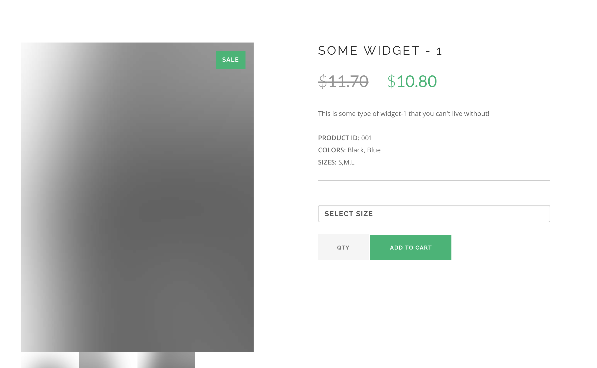

# httpgateway-demo
Simple application for demonstrating the routing capabilities of the Netifi HTTP Gateway.

## Prerequisites
This demo requires a running [Consul](https://www.consul.io/docs/index.html) instance for service discovery.

Once installed you can start a local development Consul by running the following command:

    consul agent -dev

## Building the Demo
Run the following command to build the demo components:

    ./gradlew clean build

## Building the Demo for Docker
Run the following command to build the demo components as Docker containers:

    ./gradlew clean buildImage

## Running the Demo
1. Ensure that you have a local Consul cluster running.

2. In a new terminal, run the following command to start the product service:

        ./gradlew :product-service:bootRunLocal
        
3. In a new terminal, run the following command to start the inventory service:

        ./gradlew :inventory-service:bootRunLocal
        
4. In a new terminal, run the following command to start the store application:

        ./gradlew :store-app:bootRunLocal
        
5. In a web browser, open the url [http://localhost:8082/product/001](http://localhost:8082/product/001) to view the product in the store application.

    
    
## Running the Demo in Docker
1. Ensure that you have a local Consul cluster running.

2. In a new terminal, run the following command to start the product service:

        docker run -e SPRING_PROFILES_ACTIVE='localdocker' -p 8081:8081 netifi/httpgateway-demo-product-service
        
3. In a new terminal, run the following command to start the inventory service:

        docker run -e SPRING_PROFILES_ACTIVE='localdocker' -p 8080:8080 netifi/httpgateway-demo-inventory-service
        
4. In a new terminal, run the following command to start the store application:

        docker run -e SPRING_PROFILES_ACTIVE='localdocker' -p 8082:8082 netifi/httpgateway-demo-store-app
                
5. In a web browser, open the url [http://localhost:8082/product/001](http://localhost:8082/product/001) to view the product in the store application.

## License
Copyright 2019, [Netifi Inc.](https://www.netifi.com)

Licensed under the Apache License, Version 2.0 (the "License");
you may not use this file except in compliance with the License.
You may obtain a copy of the License at

   http://www.apache.org/licenses/LICENSE-2.0

Unless required by applicable law or agreed to in writing, software
distributed under the License is distributed on an "AS IS" BASIS,
WITHOUT WARRANTIES OR CONDITIONS OF ANY KIND, either express or implied.
See the License for the specific language governing permissions and
limitations under the License.